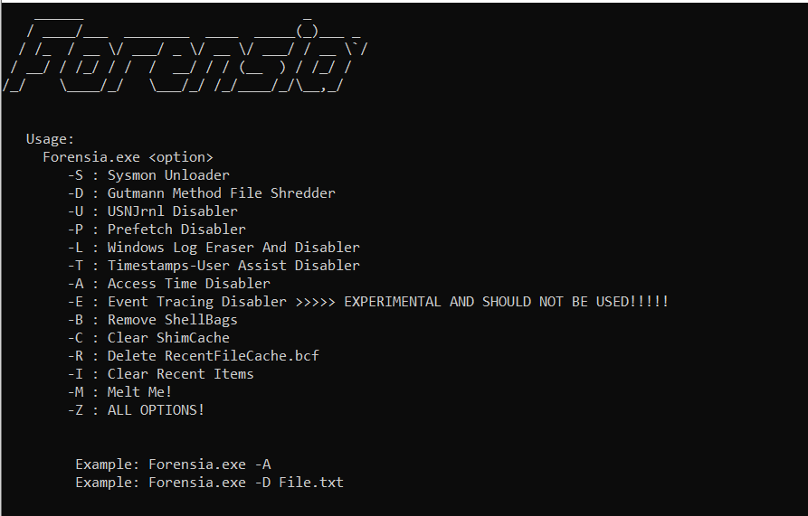

# Forensia
Anti Forensics Tool For Red Teamers, Used For Erasing Some Footprints In The Post Exploitation Phase.

## Capabilities

* Unloading Sysmon Driver.
* Gutmann Method File Shredding.
* USNJrnl Disable.
* Prefetch Disable.
* Log Eraser and Even log Disable.
* User Assist Update Time Disable.
* Access Time Disable.
* File Melting.

## TODO
- [ ] USNJRnl Execution On All Drives.

- [ ] Unallocated Space ReWriting.

- [ ] Polishing.

## Credits

https://github.com/Naranbataar/Corrupt

https://github.com/LloydLabs/delete-self-poc

https://github.com/OsandaMalith/WindowsInternals/blob/master/Unload_Minifilter.c

https://stackoverflow.com/users/15168/jonathan-leffler

https://github.com/GiovanniDicanio/WinReg
